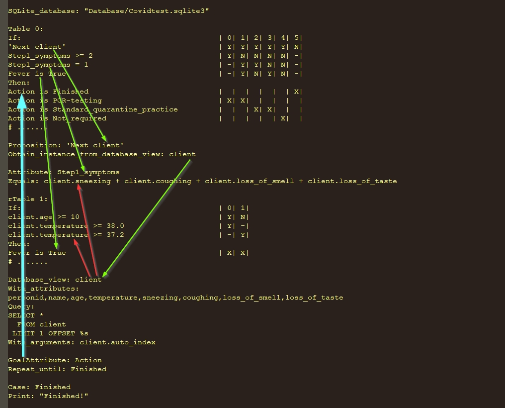
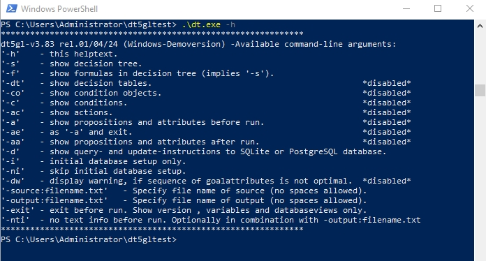

# DT5GL  
DT5GL Demo Decision Intelligence Generator (5GL)

Decision Intelligence is a combination of Decision Tables (5GL) and Database Query Language (SQL/4GL)
oriented to business people instead of IT. So does not require knowledge of any 3GL programming language.

No pre-installation of Python (and/or SQLite/PostgreSQL) required; the decision intelligence generator DT.exe runs directly under Windows and the 37 sample scripts (see: 'Demo - Help.txt') can be executed immediately. 

DT.exe is python code (version 3.6.0), compiled to C code with Nuitka 2.0.2 (https://nuitka.net/) and thus a lot faster.
If a virus scanner intervenes, the program can be safely restored from a vault or quarantine. Or disable your virus scanner for a while
during Download Zip (at least my virus scanner is somewhat inconsistent in its intervention). 

DT.exe connects directly to SQLite and PostgreSQL, but any other database or cloud platform can be built in upon request.  

All sample scripts refer to: 
https://dmcommunity.org/challenge/

For a background of this approach see:
https://dmcommunity.org/2021/09/02/is-sql-for-business-or-it/

#### Instructions for downloading and unpacking files:  
1. Download and unpack: DT5GL FIRST.rar  
After that:  
2. Download and unpack: DT5GL SECOND.rar  
3. Download and unpack: DT5GL THIRD.rar  
4. Download and unpack: DT5GL FOURTH.rar  
5. Download and unpack: DT5GL FIFTH.rar  
6. Download and unpack: DT5GL SIXTH.rar  
7. Download all other files

Download can also be done at once with Download ZIP, but unpack in this order.
After correctly unpacking, the root folder contains 92+ objects and that's including 
the subfolders _pycache_, database, nose, numpy, psycopg2.  

See: Demo - Help.txt
Recommended tool: Notepad++

Use DTFunctions.py to connect DT.exe to PostgreSQL and for custom Python functions. 

PS C:\..\..\DT5GL> .\DT.exe -h

